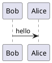

PlantUML is not directly supported by GitHub, but its still possible.
Basically we pass your puml file to PlantUML to generate, and they return a PNG which gets included in the page

* Generate you .puml file in the usual way using your favorite editor and confirm the diagram is as you want it.
* Save the file to the assets directory
* Then paste the following into you Markup. 

PlantUML is a text descriptive language which gets converted into UML and other types of graphs
So this :- 



would produce this :- 


A more complex example :-

```

```


